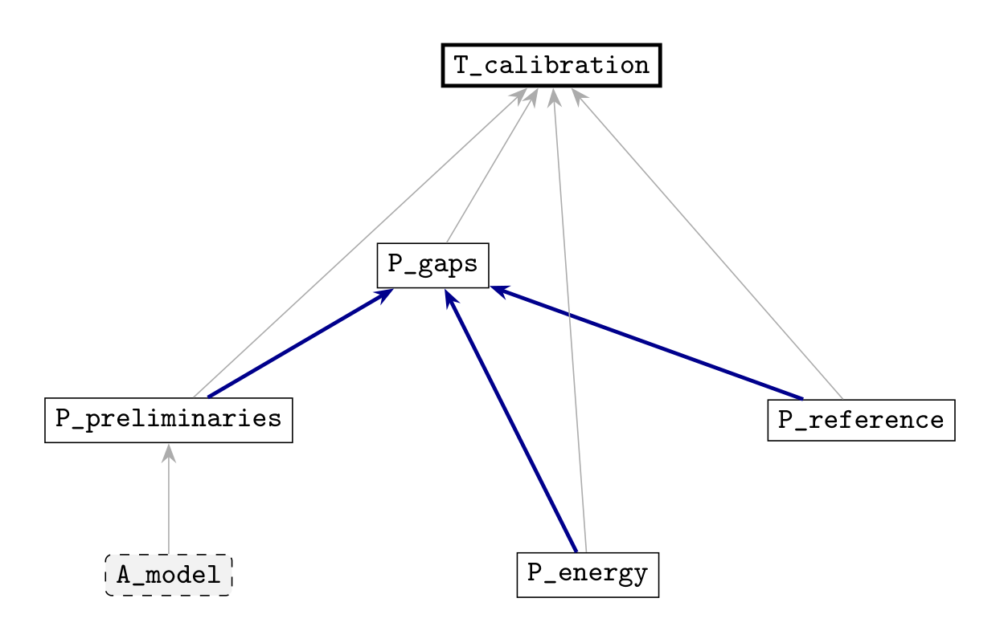

# Machine-Checked Proofs for Fixed-Price Bilateral Trade

This repository accompanies *The Exact Welfare Guarantee of Fixed-Price Bilateral Trade*. It contains the Lean 4 development, the statement and dependency manifest, and the exact, interval-arithmetic, and SMT certificates used in the computer-assisted results.

This guide follows the [formalization supplement (PDF)](research_ideas/probes/fixed_price/manuscript/formalization_supplement.pdf), also available on [Google Drive](https://drive.google.com/file/d/1bG8ySCTCiVD0MK4EAhtyTkSXpvBY_4NC/view?usp=drivesdk). The supplement gives the complete statement-by-statement correspondence and explains the limits of each credential.

## What we checked

The development has **130 Lean source files and 1,701 theorem or lemma declarations**. The recorded full build completed 8,605 jobs with no errors. The sources contain no `sorry`, custom axioms, or `native_decide`; credentialed declarations depend only on Lean's standard foundational axioms `propext`, `Classical.choice`, and `Quot.sound`.

The manifest tracks 29 paper statements. Twenty-five have Lean counterparts, including nine conditional on externally certified facts. Coverage ranges from complete statements to selected components; the correspondence table and scope notes below specify the distinction.

| Paper result | What the Lean development establishes | Entry point |
| --- | --- | --- |
| Theorem A: exact welfare guarantee | The unique root defining the constant, a strict inequality for every admissible pair, bounded pairs approaching the constant, and the greatest lower bound | [TheoremA.lean](research_ideas/probes/fixed_price/lean/FixedPrice/TheoremA.lean) |
| Theorem B: affine and conditional frontiers | The sharp frontier, its shape, the conditional infimum, and conjugate duality; boundedness of the refuting and approaching witnesses is not in the exported types | [FrontierAffine.lean](research_ideas/probes/fixed_price/lean/FixedPrice/FrontierAffine.lean), [FrontierConditional.lean](research_ideas/probes/fixed_price/lean/FixedPrice/FrontierConditional.lean), [FrontierConvex.lean](research_ideas/probes/fixed_price/lean/FixedPrice/FrontierConvex.lean) |
| Corollary B′: endpoint asymptotics | All four asymptotic equivalences | [Asymptotics.lean](research_ideas/probes/fixed_price/lean/FixedPrice/Asymptotics.lean) |
| Theorem C: global calibration | The optimal bound, attainment by the explicit control, and uniqueness up to equality almost everywhere | [TheoremC.lean](research_ideas/probes/fixed_price/lean/FixedPrice/TheoremC.lean) |
| Proposition 12.2 and Corollary A′: dominant strategies | The price representation and welfare ceiling, for a mechanism class containing the paper's class | [Mechanism.lean](research_ideas/probes/fixed_price/lean/FixedPrice/Mechanism.lean), [CorollaryDSIC.lean](research_ideas/probes/fixed_price/lean/FixedPrice/CorollaryDSIC.lean) |
| Theorem D: two-unit separation | Exact evaluation of the two finite instances using `decide +kernel`; decimal comparisons use external interval arithmetic | [TwoUnit/TheoremD.lean](research_ideas/probes/fixed_price/lean/FixedPrice/TwoUnit/TheoremD.lean) |
| Theorem E and the finite-node recurrence | The analytic conclusions, conditional on the pricing certificate structures | [TwoUnit/Pricing](research_ideas/probes/fixed_price/lean/FixedPrice/TwoUnit/Pricing) |
| Proposition 13.2 and its seven lemmas | Curve-family optimization, conditional on the relevant numerical and algebraic certificate structures; the shape lemma is unconditional | [TwoUnit/Family/Final.lean](research_ideas/probes/fixed_price/lean/FixedPrice/TwoUnit/Family/Final.lean) |

## The manifest as a graph

The [manifest](research_ideas/probes/fixed_price/manuscript/factgraph.toml) has **103 vertices and 164 edges**: 35 vertices describe the paper's assumptions, definitions, and statements; 24 describe scalar facts; and 44 record Lean renderings. An edge runs from a premise to a conclusion that uses it.

[](docs/figures/theorem-c-dependency.svg)

*Figure 1 from the formalization supplement. The dependency cone of Theorem C has six vertices and eight edges. Reading upward follows the paper's argument. The dashed node is an assumption; the thick node is the theorem. The three bold blue edges identify the premises recorded for `P_gaps`.* [Vector image](docs/figures/theorem-c-dependency.svg)

A credential attaches to a stored statement together with its premise set. The checker recomputes the existing fingerprint of that pair and checks for dangling references and cycles. `blast <node>` lists downstream statements affected by a change; `audit <node>` reports the evidence along the upstream dependency closure.

Lean maintains its own declaration dependency graph and checks formal proofs there. The manuscript manifest records how those declarations and external certificates support printed claims. Its consistency check does not establish that a Lean type means the same thing as the paper's statement.

## Verification layers

| Kind of claim | Evidence in this repository |
| --- | --- |
| Deductive mathematical statements | Lean proofs checked against Mathlib and the stated premises |
| Finite instances and polynomial certificates | Exact rational evaluation, exact symbolic residuals, and Bernstein certificates |
| Decimal bounds and interval covers | Arb ball arithmetic over stored enclosures and partitions |
| Scalar implications | Checks by z3 and cvc5, with assumptions retained in the receipts |

The [standalone replay](research_ideas/probes/fixed_price/manuscript/supplement/verify.py) reads the stored certificates without repeating the search that found them. It evaluates finite instances with exact rationals, checks Bernstein trees on the affine boundary families, and replays the interval covers of the stationary branch. For stored identity and sign files, it checks recorded residuals and enclosures; the additional scripts reproduce the underlying local algebra and solver implications.

The standalone replay reports **37 checks, 0 failed**, including the enclosure

```text
0.73802433573 < beta_* < 0.73802433574
```

The two instances of Theorem D are checked both by this rational replay and inside Lean's kernel. Floating-point explorations supporting the general two-unit conjecture are not proof credentials.

## Certified facts as Lean hypotheses

Already certified numerical and scalar facts enter the two-unit Lean theorems as explicit arguments. Their fields state the formula in the notation of the development and identify the external evidence.

| Structure | Fields | Contents and source |
| --- | ---: | --- |
| `PricingScalarCertificates` | 12 | Price-constraint identities and Farkas certificates, contraction bounds, and rounded-buyer inequalities; [Pricing/Defs.lean](research_ideas/probes/fixed_price/lean/FixedPrice/TwoUnit/Pricing/Defs.lean) |
| `NodeScalarCertificates` | 4 | Minimality and monotonicity of a recurrence step, termwise kernel comparison, and convexity of a three-way maximum; [Pricing/FiniteNodes.lean](research_ideas/probes/fixed_price/lean/FixedPrice/TwoUnit/Pricing/FiniteNodes.lean) |
| `FamilyNumerics` | 10 | Small-mass and boundary bounds, rational constants, stationary-point isolation and physical margins, and the rational polygon witness; [Family/Certificates.lean](research_ideas/probes/fixed_price/lean/FixedPrice/TwoUnit/Family/Certificates.lean) |
| `FamilyIdentities` | 52 | Quadratures, Euler identities, contact densities, reconstruction formulas, stationarity reductions, and price-region algebra; [Family/Certificates.lean](research_ideas/probes/fixed_price/lean/FixedPrice/TwoUnit/Family/Certificates.lean) |

These premises are visible in theorem types. For example, the family optimum has type `FamilyNumerics → FamilyIdentities → OptimumStatement`. They are arguments, so they appear under `#check`, rather than as additional axioms under `#print axioms`. The conditional interval-cover premises, including monotonicity of the algebraic residual, are retained explicitly and discharged by the relevant Lean lemmas as described in the supplement.

## Where the formal and printed statements differ

The supplement records the differences individually. The principal boundaries are:

- **Frontier witnesses:** the exported Theorem B types establish sharpness and the conditional infimum, but do not assert bounded support of their witnesses.
- **Calibration identity:** the bound, attainment, and almost-everywhere uniqueness are fully proved. The combined identity (G) is represented by components for positive curvature; its zero-curvature endpoint integral identity is not formalized.
- **Reference family:** the components used by Theorem C are proved; the full monotone parametrization and some regularity clauses are not stated.
- **Hard pairs and smoothing:** Lean proves the price-gain upper bounds needed downstream, rather than every printed equality. The smoothing statement omits the full-support clause.
- **Dominant strategies:** Lean uses a broader mechanism class defined by the expected individual-rationality and budget inequalities. The resulting ceiling applies to the paper's class as well.
- **Two-unit infimum:** `r2star` is defined, but the comparison applying that infimum to Theorem D's instances is not exported.

The arctangent closed form, the best-price existence and randomization clauses, and several analytic two-unit reductions remain outside Lean. Numerical enclosures have their own external certificates. The general two-unit exact-ratio conjecture remains open.

The [TeX/Lean comparison](research_ideas/probes/fixed_price/manuscript/checks/statement_correspondence.md) displays the paired source statements. Its [JSON companion](research_ideas/probes/fixed_price/manuscript/checks/statement_correspondence.json) expands named statement definitions and certificate structures. The script catches missing names and incorrect file references; agreement of quantifiers, assumptions, definitions, and equality cases requires semantic review.

## How to rerun the checks

The toolchain is pinned to **Lean 4.30.0** and Mathlib commit **`c5ea00351c28e24afc9f0f84379aa41082b1188f`**, the only direct library dependency. With Lean installed through `elan`:

```sh
cd research_ideas/probes/fixed_price/lean
lake exe cache get
lake build FixedPrice
```

To inspect both axiom dependencies and explicit premises, use a Lean file importing the library:

```lean
import FixedPrice

#print axioms FixedPrice.theoremA
#check @FixedPrice.TwoUnit.Family.prop_2fam_optimum
```

The first command should list only `[propext, Classical.choice, Quot.sound]`; the second exposes the family certificate hypotheses. A successful build alone does not rule out incomplete proofs or additional axioms.

For the external checks, use Python 3.11 or later. From the repository root:

```sh
python -m pip install -r requirements.txt
python research_ideas/probes/fixed_price/manuscript/supplement/verify.py
python research_ideas/probes/fixed_price/manuscript/first_layer_repair_20260921.py --run
python research_ideas/probes/fixed_price/manuscript/checks/first_layer_20260921/max_convexity_exact.py
python research_ideas/probes/fixed_price/manuscript/checks/first_layer_repair_20260921/physical_conditions.py
```

`verify.py --fast` skips the two interval-cover replays. The supported commands above work without the full manuscript; some historical driver programs additionally require its TeX for source-location metadata. These distinctions are documented in [PACKAGING.md](PACKAGING.md).

Inspect the manifest and regenerate the source comparison from the repository root:

```sh
python proof_factgraph/factgraph.py research_ideas/probes/fixed_price/manuscript/factgraph.toml check
python research_ideas/probes/fixed_price/manuscript/statement_correspondence.py
```

The published checkout uses the included TeX excerpts. Supply `--tex-dir /path/to/manuscript` to compare an updated complete manuscript. The figure can be re-exported from the supplement with [docs/export_dependency_figure.py](docs/export_dependency_figure.py), using the optional `pymupdf` package.

The [reproduction record](reproduction/README.md) gives the standalone replay results and tested Python versions. The unchanged Lean development retains its recorded build and axiom-check credentials. Original directory paths are preserved so that the checking programs resolve their inputs; [PACKAGING.md](PACKAGING.md) lists the selected sources and the repository-relative ledger adaptation.
